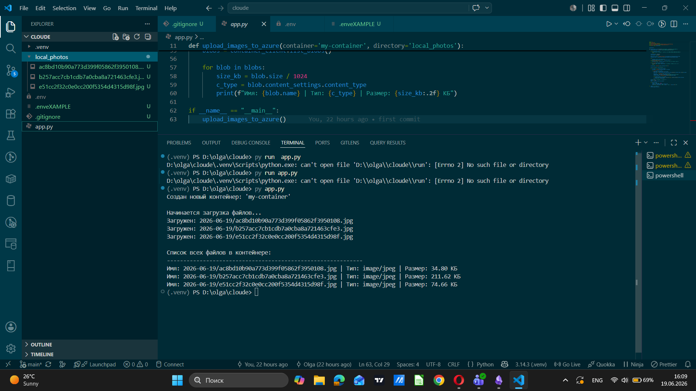
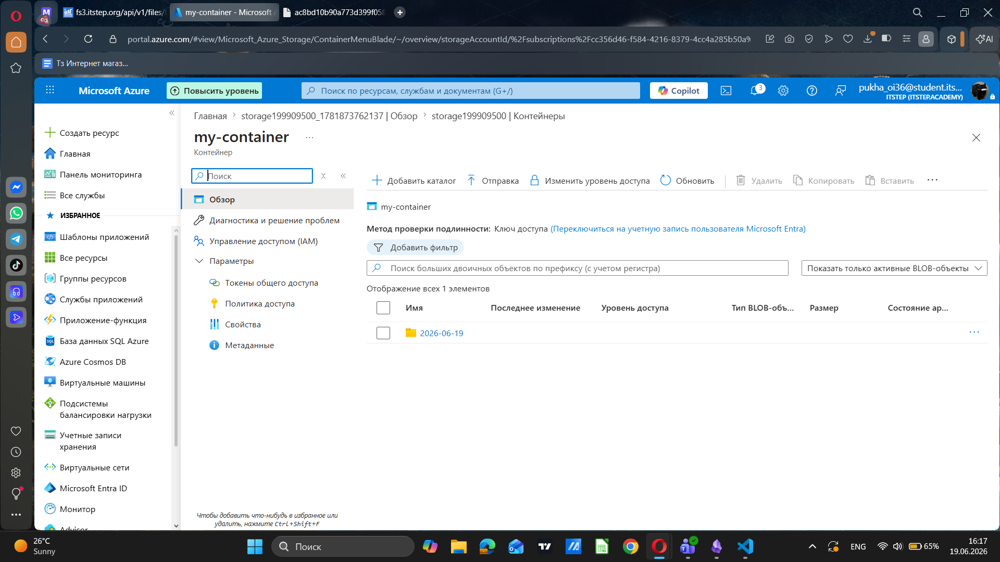
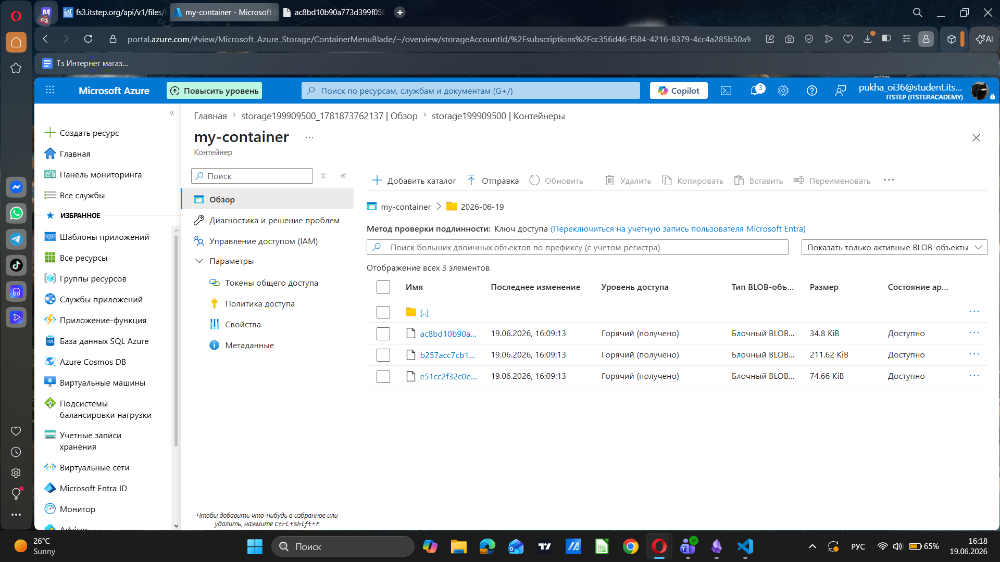

# Task

Напиши скрипт, який копіює картинки з локальної папки у сховище Azure. Скрипт має знайти папку з назвою local_photos, підключитися до Azure через рядок підключення та автоматично створити контейнер gallery-project, якщо його ще немає. Кожен файл потрібно завантажити в хмару, додавши до його імені поточну дату як назву папки, наприклад, 2026-06-12/photo.jpg. Також важливо автоматично визначати тип файлу, щоб картинки відкривалися в браузері, а не скачувалися. Наприкінці скрипт має вивести в консоль список усіх файлів із цього контейнера, показуючи їхні імена, типи та розмір у кілобайтах.

## Terminal

отображение изображения в контейнере

папка с датой

картинки

